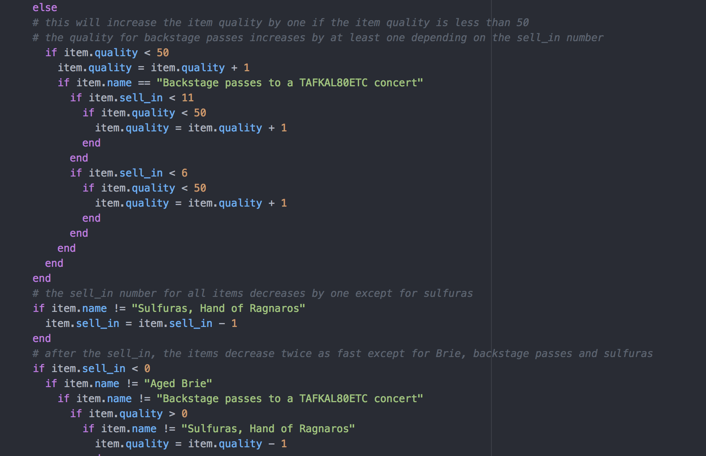
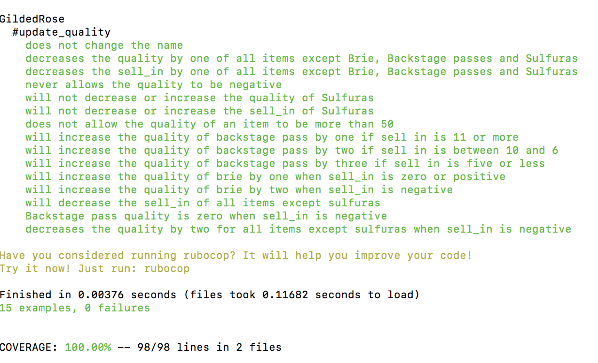

# GildedRose-Refactoring-Kata

As part of Makers' week 10 tech test week, I completed the GildedRose refactoring Kata in Ruby.  This was to test my ability to read, refactor and extend legacy code.  

First I set up my repository on Github and installed a linter and line coverage indicator.  

Then I started looking at the problem.  It is a problem that requires careful reading and understanding before I could begin refactoring.  I started by reading the legacy code and writing notes when I could understand the functions of the different parts of the code.  My aim is to turn all the nested if statements into small clean methods. The idea is that when I have to add the new item - "Conjured", it should be easy to add this to the code.

I then started writing tests until coverage reached 100%.  After writing one test I ran rspec to make sure the test passes.  By writing the tests I found I was able to understand the code better.  

One thing I am aware of is that although I have 100% test coverage, this does not mean I have tested for all evenualities so even if I refactor and all tests pass, I should write more tests and look for ways to prove I'm wrong.  

Now to start refactoring.

I have written a method but I have failing tests and I'm not sure why because the code looks correct to me.  Using irb, I can see that the code is giving me the correct output so there must be a problem with the test.
