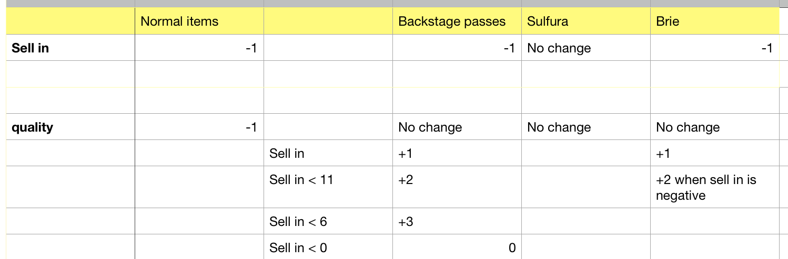

# GildedRose-Refactoring-Kata

As part of Makers' week 10 tech test week, I completed the GildedRose refactoring Kata in Ruby.  This was to test my ability to read, refactor and extend legacy code.  

First I set up my repository on Github and installed a linter and line coverage indicator.  

Then I started looking at the problem.  It is a problem that requires careful reading and understanding before I could begin refactoring.  I started by reading the legacy code and writing notes when I could understand the functions of different parts of the code.  My aim is to turn all the nested if statements into small clean methods. The idea is that when I have to add the new item - "Conjured", it should be easy to add this to the code.

I then started writing tests until coverage reached 100%.  After writing one test I ran rspec to make sure the test passes.  By writing the tests I found I was able to understand the code better.  

To plan how I was going to write the new methods took a lot of modelling, I wrote pages of notes in my notebook and using a spreadsheet like this helped me to visualise the problem:

I started deleting old code and writing new methods.  Soon all tests were failing.  But after a while rspec started to look like this:

and then finally it looked like this!

IRB helped me to feature test and really helped with debugging.

After refactoring the code, I then added in the new item "Conjured".  This is an item that degrades twice as fast as other items.  First I wrote the test.  Then I added "Conjured" to the constant variable SPECIAL ITEMS array.  Then I wrote the method and ran rspec, and the test passes!
I'm happy with my code because adding the new item was pretty easy and my methods obey the single responsibility principle.  

If I had more time I would write more tests and look for ways to prove I'm wrong as I don't think I have covered all edge cases.  I would also mock the Item class in the GildedRose unit tests.
