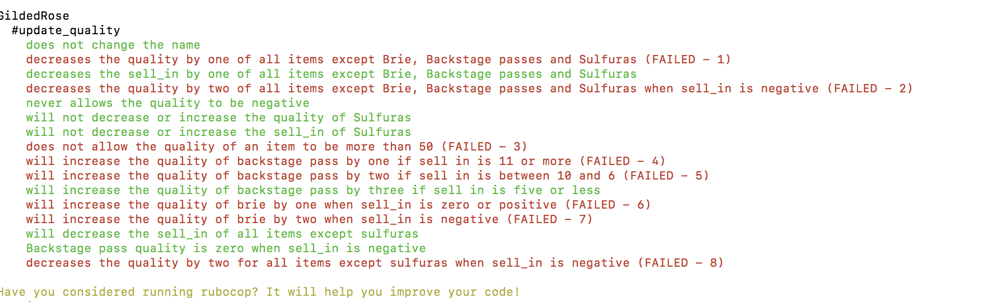
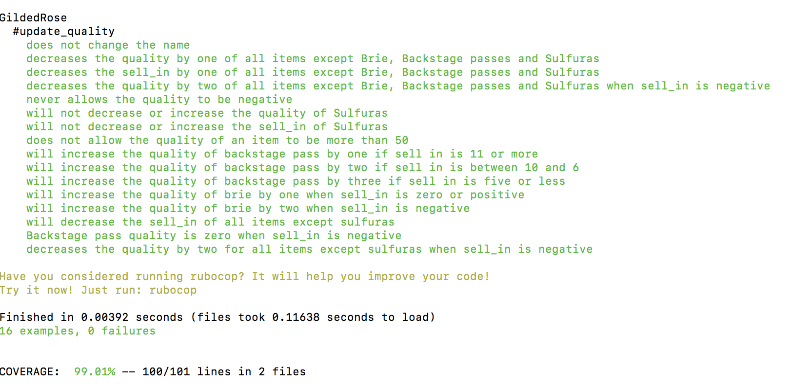
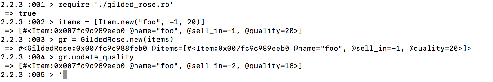

# GildedRose-Refactoring-Kata

As part of Makers' week 10 tech test week, I completed the GildedRose refactoring Kata in Ruby.  This was to test my ability to read, refactor and extend legacy code.  

First I set up my repository on Github and installed a linter and line coverage indicator.  

Then I started looking at the problem.  It is a problem that requires careful reading and understanding before I could begin refactoring.  I started by reading the legacy code and writing notes when I could understand the functions of the different parts of the code.  My aim is to turn all the nested if statements into small clean methods. The idea is that when I have to add the new item - "Conjured", it should be easy to add this to the code.

I then started writing tests until coverage reached 100%.  After writing one test I ran rspec to make sure the test passes.  By writing the tests I found I was able to understand the code better.  

I started deleting old code and writing new methods.  Soon every single test was failing.  But after a while rspec started to look like this:

and then finally it looked like this!

IRB helped me to feature test and really helped with debugging.

If I had more time I would write more tests and look for ways to prove I'm wrong as in all honesty I don't think I have covered all edge cases.  I would also mock the Item class in the GildedRose unit tests.
